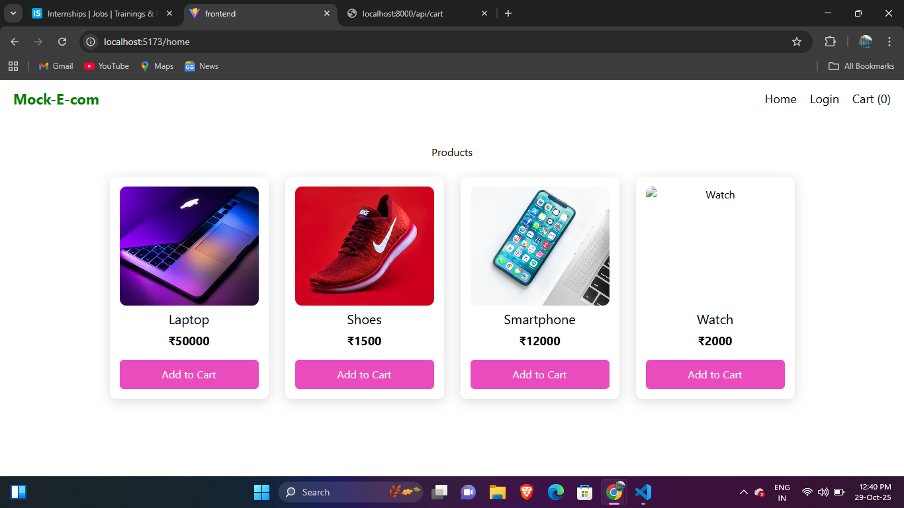
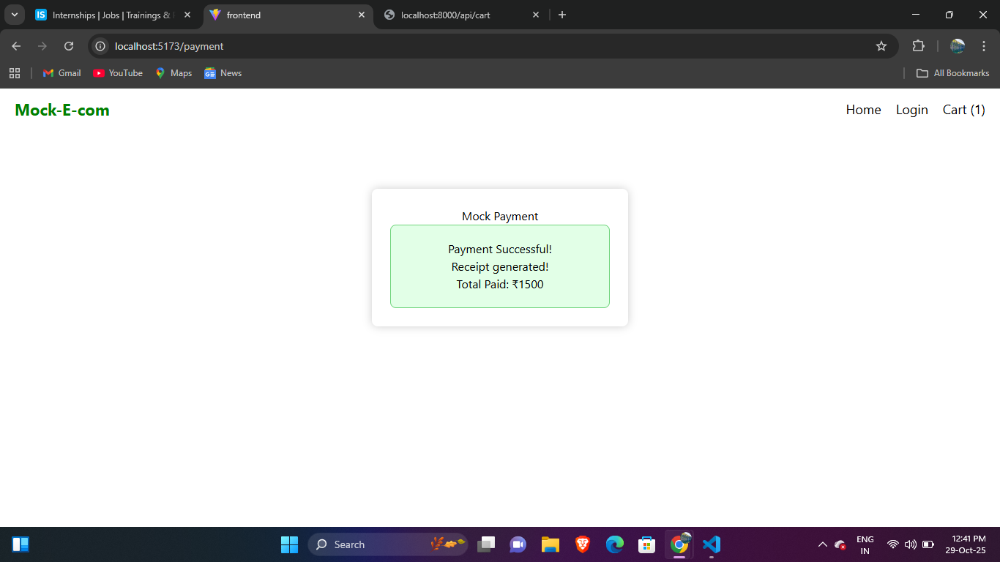

# Nexora – Mock E-Commerce Cart

A simple full-stack shopping cart application using **MERN** (React + Node + Express).

Users can:
 - View products  
 - Add items to cart  
 - Remove items  
-  Make a mock payment checkout

---

##  Tech Stack

**Frontend**
- React (Vite)
- Axios
- CSS / Tailwind (optional)

**Backend**
- Node.js
- Express.js
- CORS

**Database**
- In-Memory (No real database used)

---

##  How to Run the Project

###  Clone the repository
```sh
git clone https://github.com/YOURUSERNAME/Nexora.git
cd mock-e-com
```
### start backend
```sh
cd backend
npm install
node index.js
start at localhost:5000
```
### start frontend
```sh
cd ../frontend
npm install
npm run dev
start at localhost:5173
```

| Method | Route         | Description              |
| ------ | ------------- | ------------------------ |
| GET    | /api/products | Get products list        |
| GET    | /api/cart     | Get cart items + total   |
| POST   | /api/cart     | Add product to cart      |
| DELETE | /api/cart/:id | Remove product from cart |
| POST   | /api/checkout | Mock payment checkout    |


Demo Video


### Screenshots





